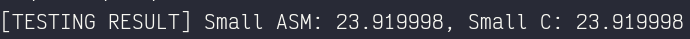
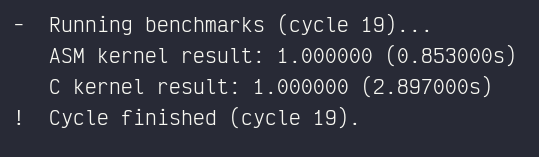

# A Brief Comparison of C-based and ASM-based Performance

We cover the entire contents of this document in the demo video [here](https://drive.google.com/file/d/1EDC1G2IOLVbhMBtM45rEyzZwuRmomZDa/view?usp=sharing).

## Methodology

We compare the execution times of two different implementations of the vector dot product operation, which we write in
both C and ASM flavors. We test our implementations with vectors of different dimensionalities; in particular, we have
elected to use `1 << 16`, `1 << 20`, `1 << 24`, `1 << 28`, and `1 << 30` as sizes for our vectors. We then go over all
these values and generate a pair of vectors with random values between `0` and `99` (note that we set the seed for the
generation to maintain reproducibility). An option for normalizing both vectors is included in the code. This makes it
easier to deal with the values and limits them to a more comprehensible range (`0` and `1`). Of course, after creating 
the vectors, we run both flavors of the dot product kernel multiple times (twenty in this case) to prevent biases from
arising due to chance. 

## Analysis and Results

We summarize the results below, which show all values in seconds. As can be seen, the ASM kernel consistently outperforms
the C kernel by a rate of at least three. The magnitude of the standard deviation we obtain for all runs also indicates a 
fairly consistent measurement across the twenty different trials, per size of vector. It might be important to note that
the standard C library functions for `time()` were used to obtain the benchmarking results shown below.

| Vector Dimensions        | C (avg / sd)              | ASM (avg / sd)            |
|-------------|----------------------------|----------------------------|
| 65,536      | 0.000150 / 0.000366        | 0.000000 / 0.000000        |
| 1,048,576   | 0.002950 / 0.000224        | 0.000850 / 0.000366        |
| 16,777,216  | 0.046650 / 0.004848        | 0.013750 / 0.001372        |
| 268,435,456 | 0.727700 / 0.006400        | 0.214950 / 0.011473        |
| 1,073,741,824 | 2.921300 / 0.029762      | 0.859800 / 0.028091        |

## Raw Outputs

This is the raw output of the initial test our program runs on startup.
It acts both as a warmup and as a sanity check for the validity of our algorithm.



For the sake of documentation and the completeness of data, we kept track of the entire output produced by the program.
A similar output can be regenerated by running the batch file, and because of the `srand(0)` seed, the values should be the same.
But to avoid necessitating the need to run the program, we have included the full dump as a reference. Look at `out.txt`.

Here is another snapshot of what the output would look like, although again the `out.txt` should contain the entire log already.




```
[TESTING RESULT] Small ASM: 23.919998, Small C: 23.919998
[!] ==============================
[!] RUNNING BENCHMARK FOR n=65536
[!] ==============================

 -  Populating vectors...
 !  Done populating vectors.

 -  Running benchmarks (cycle 0)...
    ASM kernel result: 0.746340 (0.001000s)
    C kernel result: 0.746338 (0.000000s)
 !  Cycle finished (cycle 0).

 -  Running benchmarks (cycle 1)...
    ASM kernel result: 0.746340 (0.000000s)
    C kernel result: 0.746338 (0.000000s)
 !  Cycle finished (cycle 1).

 -  Running benchmarks (cycle 2)...
    ASM kernel result: 0.746340 (0.000000s)
    C kernel result: 0.746338 (0.000000s)
 !  Cycle finished (cycle 2).

 -  Running benchmarks (cycle 3)...
    ASM kernel result: 0.746340 (0.000000s)
    C kernel result: 0.746338 (0.000000s)
 !  Cycle finished (cycle 3).

 -  Running benchmarks (cycle 4)...
    ASM kernel result: 0.746340 (0.000000s)
    C kernel result: 0.746338 (0.001000s)
 !  Cycle finished (cycle 4).

 -  Running benchmarks (cycle 5)...
    ASM kernel result: 0.746340 (0.000000s)
    C kernel result: 0.746338 (0.000000s)
 !  Cycle finished (cycle 5).

 -  Running benchmarks (cycle 6)...
    ASM kernel result: 0.746340 (0.000000s)
    C kernel result: 0.746338 (0.000000s)
 !  Cycle finished (cycle 6).

 -  Running benchmarks (cycle 7)...
    ASM kernel result: 0.746340 (0.000000s)
    C kernel result: 0.746338 (0.000000s)
 !  Cycle finished (cycle 7).

 -  Running benchmarks (cycle 8)...
    ASM kernel result: 0.746340 (0.000000s)
    C kernel result: 0.746338 (0.001000s)
 !  Cycle finished (cycle 8).

 -  Running benchmarks (cycle 9)...
    ASM kernel result: 0.746340 (0.000000s)
    C kernel result: 0.746338 (0.000000s)
 !  Cycle finished (cycle 9).

 -  Running benchmarks (cycle 10)...
    ASM kernel result: 0.746340 (0.000000s)
    C kernel result: 0.746338 (0.000000s)
 !  Cycle finished (cycle 10).

 -  Running benchmarks (cycle 11)...
    ASM kernel result: 0.746340 (0.000000s)
    C kernel result: 0.746338 (0.000000s)
 !  Cycle finished (cycle 11).

 -  Running benchmarks (cycle 12)...
    ASM kernel result: 0.746340 (0.000000s)
    C kernel result: 0.746338 (0.000000s)
 !  Cycle finished (cycle 12).

 -  Running benchmarks (cycle 13)...
    ASM kernel result: 0.746340 (0.001000s)
    C kernel result: 0.746338 (0.000000s)
 !  Cycle finished (cycle 13).

 -  Running benchmarks (cycle 14)...
    ASM kernel result: 0.746340 (0.000000s)
    C kernel result: 0.746338 (0.000000s)
 !  Cycle finished (cycle 14).

 -  Running benchmarks (cycle 15)...
    ASM kernel result: 0.746340 (0.000000s)
    C kernel result: 0.746338 (0.000000s)
 !  Cycle finished (cycle 15).

 -  Running benchmarks (cycle 16)...
    ASM kernel result: 0.746340 (0.000000s)
    C kernel result: 0.746338 (0.000000s)
 !  Cycle finished (cycle 16).

 -  Running benchmarks (cycle 17)...
    ASM kernel result: 0.746340 (0.001000s)
    C kernel result: 0.746338 (0.000000s)
 !  Cycle finished (cycle 17).

 -  Running benchmarks (cycle 18)...
    ASM kernel result: 0.746340 (0.000000s)
    C kernel result: 0.746338 (0.000000s)
 !  Cycle finished (cycle 18).

 -  Running benchmarks (cycle 19)...
    ASM kernel result: 0.746340 (0.000000s)
    C kernel result: 0.746338 (0.000000s)
 !  Cycle finished (cycle 19).

[!] ==============================
[!] RUNNING BENCHMARK FOR n=1048576
[!] ==============================

 -  Populating vectors...
 !  Done populating vectors.

 -  Running benchmarks (cycle 0)...
    ASM kernel result: 0.745804 (0.001000s)
    C kernel result: 0.745804 (0.003000s)
 !  Cycle finished (cycle 0).

 -  Running benchmarks (cycle 1)...
    ASM kernel result: 0.745804 (0.001000s)
    C kernel result: 0.745804 (0.002000s)
 !  Cycle finished (cycle 1).

 -  Running benchmarks (cycle 2)...
    ASM kernel result: 0.745804 (0.001000s)
    C kernel result: 0.745804 (0.003000s)
 !  Cycle finished (cycle 2).

 -  Running benchmarks (cycle 3)...
    ASM kernel result: 0.745804 (0.001000s)
    C kernel result: 0.745804 (0.003000s)
 !  Cycle finished (cycle 3).

 -  Running benchmarks (cycle 4)...
    ASM kernel result: 0.745804 (0.000000s)
    C kernel result: 0.745804 (0.003000s)
 !  Cycle finished (cycle 4).

 -  Running benchmarks (cycle 5)...
    ASM kernel result: 0.745804 (0.001000s)
    C kernel result: 0.745804 (0.003000s)
 !  Cycle finished (cycle 5).

 -  Running benchmarks (cycle 6)...
    ASM kernel result: 0.745804 (0.001000s)
    C kernel result: 0.745804 (0.003000s)
 !  Cycle finished (cycle 6).

 -  Running benchmarks (cycle 7)...
    ASM kernel result: 0.745804 (0.000000s)
    C kernel result: 0.745804 (0.003000s)
 !  Cycle finished (cycle 7).

 -  Running benchmarks (cycle 8)...
    ASM kernel result: 0.745804 (0.001000s)
    C kernel result: 0.745804 (0.003000s)
 !  Cycle finished (cycle 8).

 -  Running benchmarks (cycle 9)...
    ASM kernel result: 0.745804 (0.001000s)
    C kernel result: 0.745804 (0.003000s)
 !  Cycle finished (cycle 9).

 -  Running benchmarks (cycle 10)...
    ASM kernel result: 0.745804 (0.000000s)
    C kernel result: 0.745804 (0.003000s)
 !  Cycle finished (cycle 10).

 -  Running benchmarks (cycle 11)...
    ASM kernel result: 0.745804 (0.001000s)
    C kernel result: 0.745804 (0.003000s)
 !  Cycle finished (cycle 11).

 -  Running benchmarks (cycle 12)...
    ASM kernel result: 0.745804 (0.001000s)
    C kernel result: 0.745804 (0.003000s)
 !  Cycle finished (cycle 12).

 -  Running benchmarks (cycle 13)...
    ASM kernel result: 0.745804 (0.001000s)
    C kernel result: 0.745804 (0.003000s)
 !  Cycle finished (cycle 13).

 -  Running benchmarks (cycle 14)...
    ASM kernel result: 0.745804 (0.001000s)
    C kernel result: 0.745804 (0.002000s)
 !  Cycle finished (cycle 14).

 -  Running benchmarks (cycle 15)...
    ASM kernel result: 0.745804 (0.001000s)
    C kernel result: 0.745804 (0.003000s)
 !  Cycle finished (cycle 15).

 -  Running benchmarks (cycle 16)...
    ASM kernel result: 0.745804 (0.001000s)
    C kernel result: 0.745804 (0.003000s)
 !  Cycle finished (cycle 16).

 -  Running benchmarks (cycle 17)...
    ASM kernel result: 0.745804 (0.001000s)
    C kernel result: 0.745804 (0.003000s)
 !  Cycle finished (cycle 17).

 -  Running benchmarks (cycle 18)...
    ASM kernel result: 0.745804 (0.001000s)
    C kernel result: 0.745804 (0.003000s)
 !  Cycle finished (cycle 18).

 -  Running benchmarks (cycle 19)...
    ASM kernel result: 0.745804 (0.000000s)
    C kernel result: 0.745804 (0.004000s)
 !  Cycle finished (cycle 19).

[!] ==============================
[!] RUNNING BENCHMARK FOR n=16777216
[!] ==============================

 -  Populating vectors...
 !  Done populating vectors.

 -  Running benchmarks (cycle 0)...
    ASM kernel result: 0.748193 (0.014000s)
    C kernel result: 0.748254 (0.045000s)
 !  Cycle finished (cycle 0).

 -  Running benchmarks (cycle 1)...
    ASM kernel result: 0.748193 (0.013000s)
    C kernel result: 0.748254 (0.046000s)
 !  Cycle finished (cycle 1).

 -  Running benchmarks (cycle 2)...
    ASM kernel result: 0.748193 (0.013000s)
    C kernel result: 0.748254 (0.045000s)
 !  Cycle finished (cycle 2).

 -  Running benchmarks (cycle 3)...
    ASM kernel result: 0.748193 (0.012000s)
    C kernel result: 0.748254 (0.045000s)
 !  Cycle finished (cycle 3).

 -  Running benchmarks (cycle 4)...
    ASM kernel result: 0.748193 (0.014000s)
    C kernel result: 0.748254 (0.046000s)
 !  Cycle finished (cycle 4).

 -  Running benchmarks (cycle 5)...
    ASM kernel result: 0.748193 (0.013000s)
    C kernel result: 0.748254 (0.046000s)
 !  Cycle finished (cycle 5).

 -  Running benchmarks (cycle 6)...
    ASM kernel result: 0.748193 (0.014000s)
    C kernel result: 0.748254 (0.047000s)
 !  Cycle finished (cycle 6).

 -  Running benchmarks (cycle 7)...
    ASM kernel result: 0.748193 (0.014000s)
    C kernel result: 0.748254 (0.047000s)
 !  Cycle finished (cycle 7).

 -  Running benchmarks (cycle 8)...
    ASM kernel result: 0.748193 (0.014000s)
    C kernel result: 0.748254 (0.047000s)
 !  Cycle finished (cycle 8).

 -  Running benchmarks (cycle 9)...
    ASM kernel result: 0.748193 (0.013000s)
    C kernel result: 0.748254 (0.046000s)
 !  Cycle finished (cycle 9).

 -  Running benchmarks (cycle 10)...
    ASM kernel result: 0.748193 (0.013000s)
    C kernel result: 0.748254 (0.045000s)
 !  Cycle finished (cycle 10).

 -  Running benchmarks (cycle 11)...
    ASM kernel result: 0.748193 (0.014000s)
    C kernel result: 0.748254 (0.048000s)
 !  Cycle finished (cycle 11).

 -  Running benchmarks (cycle 12)...
    ASM kernel result: 0.748193 (0.013000s)
    C kernel result: 0.748254 (0.046000s)
 !  Cycle finished (cycle 12).

 -  Running benchmarks (cycle 13)...
    ASM kernel result: 0.748193 (0.013000s)
    C kernel result: 0.748254 (0.045000s)
 !  Cycle finished (cycle 13).

 -  Running benchmarks (cycle 14)...
    ASM kernel result: 0.748193 (0.013000s)
    C kernel result: 0.748254 (0.047000s)
 !  Cycle finished (cycle 14).

 -  Running benchmarks (cycle 15)...
    ASM kernel result: 0.748193 (0.013000s)
    C kernel result: 0.748254 (0.047000s)
 !  Cycle finished (cycle 15).

 -  Running benchmarks (cycle 16)...
    ASM kernel result: 0.748193 (0.013000s)
    C kernel result: 0.748254 (0.045000s)
 !  Cycle finished (cycle 16).

 -  Running benchmarks (cycle 17)...
    ASM kernel result: 0.748193 (0.013000s)
    C kernel result: 0.748254 (0.045000s)
 !  Cycle finished (cycle 17).

 -  Running benchmarks (cycle 18)...
    ASM kernel result: 0.748193 (0.014000s)
    C kernel result: 0.748254 (0.044000s)
 !  Cycle finished (cycle 18).

 -  Running benchmarks (cycle 19)...
    ASM kernel result: 0.748193 (0.014000s)
    C kernel result: 0.748254 (0.045000s)
 !  Cycle finished (cycle 19).

[!] ==============================
[!] RUNNING BENCHMARK FOR n=268435456
[!] ==============================

 -  Populating vectors...
 !  Done populating vectors.

 -  Running benchmarks (cycle 0)...
    ASM kernel result: 1.000000 (0.212000s)
    C kernel result: 1.000000 (0.724000s)
 !  Cycle finished (cycle 0).

 -  Running benchmarks (cycle 1)...
    ASM kernel result: 1.000000 (0.209000s)
    C kernel result: 1.000000 (0.723000s)
 !  Cycle finished (cycle 1).

 -  Running benchmarks (cycle 2)...
    ASM kernel result: 1.000000 (0.207000s)
    C kernel result: 1.000000 (0.718000s)
 !  Cycle finished (cycle 2).

 -  Running benchmarks (cycle 3)...
    ASM kernel result: 1.000000 (0.204000s)
    C kernel result: 1.000000 (0.794000s)
 !  Cycle finished (cycle 3).

 -  Running benchmarks (cycle 4)...
    ASM kernel result: 1.000000 (0.221000s)
    C kernel result: 1.000000 (0.738000s)
 !  Cycle finished (cycle 4).

 -  Running benchmarks (cycle 5)...
    ASM kernel result: 1.000000 (0.210000s)
    C kernel result: 1.000000 (0.740000s)
 !  Cycle finished (cycle 5).

 -  Running benchmarks (cycle 6)...
    ASM kernel result: 1.000000 (0.276000s)
    C kernel result: 1.000000 (0.740000s)
 !  Cycle finished (cycle 6).

 -  Running benchmarks (cycle 7)...
    ASM kernel result: 1.000000 (0.228000s)
    C kernel result: 1.000000 (0.741000s)
 !  Cycle finished (cycle 7).

 -  Running benchmarks (cycle 8)...
    ASM kernel result: 1.000000 (0.216000s)
    C kernel result: 1.000000 (0.755000s)
 !  Cycle finished (cycle 8).

 -  Running benchmarks (cycle 9)...
    ASM kernel result: 1.000000 (0.283000s)
    C kernel result: 1.000000 (0.729000s)
 !  Cycle finished (cycle 9).

 -  Running benchmarks (cycle 10)...
    ASM kernel result: 1.000000 (0.213000s)
    C kernel result: 1.000000 (0.724000s)
 !  Cycle finished (cycle 10).

 -  Running benchmarks (cycle 11)...
    ASM kernel result: 1.000000 (0.206000s)
    C kernel result: 1.000000 (0.728000s)
 !  Cycle finished (cycle 11).

 -  Running benchmarks (cycle 12)...
    ASM kernel result: 1.000000 (0.208000s)
    C kernel result: 1.000000 (0.723000s)
 !  Cycle finished (cycle 12).

 -  Running benchmarks (cycle 13)...
    ASM kernel result: 1.000000 (0.209000s)
    C kernel result: 1.000000 (0.723000s)
 !  Cycle finished (cycle 13).

 -  Running benchmarks (cycle 14)...
    ASM kernel result: 1.000000 (0.209000s)
    C kernel result: 1.000000 (0.726000s)
 !  Cycle finished (cycle 14).

 -  Running benchmarks (cycle 15)...
    ASM kernel result: 1.000000 (0.214000s)
    C kernel result: 1.000000 (0.730000s)
 !  Cycle finished (cycle 15).

 -  Running benchmarks (cycle 16)...
    ASM kernel result: 1.000000 (0.211000s)
    C kernel result: 1.000000 (0.723000s)
 !  Cycle finished (cycle 16).

 -  Running benchmarks (cycle 17)...
    ASM kernel result: 1.000000 (0.206000s)
    C kernel result: 1.000000 (0.735000s)
 !  Cycle finished (cycle 17).

 -  Running benchmarks (cycle 18)...
    ASM kernel result: 1.000000 (0.218000s)
    C kernel result: 1.000000 (0.726000s)
 !  Cycle finished (cycle 18).

 -  Running benchmarks (cycle 19)...
    ASM kernel result: 1.000000 (0.209000s)
    C kernel result: 1.000000 (0.724000s)
 !  Cycle finished (cycle 19).

[!] ==============================
[!] RUNNING BENCHMARK FOR n=1073741824
[!] ==============================

 -  Populating vectors...
 !  Done populating vectors.

 -  Running benchmarks (cycle 0)...
    ASM kernel result: 1.000000 (0.836000s)
    C kernel result: 1.000000 (2.906000s)
 !  Cycle finished (cycle 0).

 -  Running benchmarks (cycle 1)...
    ASM kernel result: 1.000000 (0.870000s)
    C kernel result: 1.000000 (2.997000s)
 !  Cycle finished (cycle 1).

 -  Running benchmarks (cycle 2)...
    ASM kernel result: 1.000000 (0.875000s)
    C kernel result: 1.000000 (2.971000s)
 !  Cycle finished (cycle 2).

 -  Running benchmarks (cycle 3)...
    ASM kernel result: 1.000000 (0.838000s)
    C kernel result: 1.000000 (2.915000s)
 !  Cycle finished (cycle 3).

 -  Running benchmarks (cycle 4)...
    ASM kernel result: 1.000000 (0.827000s)
    C kernel result: 1.000000 (2.971000s)
 !  Cycle finished (cycle 4).

 -  Running benchmarks (cycle 5)...
    ASM kernel result: 1.000000 (0.905000s)
    C kernel result: 1.000000 (2.988000s)
 !  Cycle finished (cycle 5).

 -  Running benchmarks (cycle 6)...
    ASM kernel result: 1.000000 (0.836000s)
    C kernel result: 1.000000 (2.956000s)
 !  Cycle finished (cycle 6).

 -  Running benchmarks (cycle 7)...
    ASM kernel result: 1.000000 (0.874000s)
    C kernel result: 1.000000 (2.961000s)
 !  Cycle finished (cycle 7).

 -  Running benchmarks (cycle 8)...
    ASM kernel result: 1.000000 (0.840000s)
    C kernel result: 1.000000 (2.916000s)
 !  Cycle finished (cycle 8).

 -  Running benchmarks (cycle 9)...
    ASM kernel result: 1.000000 (0.884000s)
    C kernel result: 1.000000 (3.014000s)
 !  Cycle finished (cycle 9).

 -  Running benchmarks (cycle 10)...
    ASM kernel result: 1.000000 (0.903000s)
    C kernel result: 1.000000 (3.059000s)
 !  Cycle finished (cycle 10).

 -  Running benchmarks (cycle 11)...
    ASM kernel result: 1.000000 (0.972000s)
    C kernel result: 1.000000 (2.968000s)
 !  Cycle finished (cycle 11).

 -  Running benchmarks (cycle 12)...
    ASM kernel result: 1.000000 (0.860000s)
    C kernel result: 1.000000 (3.030000s)
 !  Cycle finished (cycle 12).

 -  Running benchmarks (cycle 13)...
    ASM kernel result: 1.000000 (0.865000s)
    C kernel result: 1.000000 (2.904000s)
 !  Cycle finished (cycle 13).

 -  Running benchmarks (cycle 14)...
    ASM kernel result: 1.000000 (0.854000s)
    C kernel result: 1.000000 (3.018000s)
 !  Cycle finished (cycle 14).

 -  Running benchmarks (cycle 15)...
    ASM kernel result: 1.000000 (0.865000s)
    C kernel result: 1.000000 (3.115000s)
 !  Cycle finished (cycle 15).

 -  Running benchmarks (cycle 16)...
    ASM kernel result: 1.000000 (0.933000s)
    C kernel result: 1.000000 (3.008000s)
 !  Cycle finished (cycle 16).

 -  Running benchmarks (cycle 17)...
    ASM kernel result: 1.000000 (0.928000s)
    C kernel result: 1.000000 (2.979000s)
 !  Cycle finished (cycle 17).

 -  Running benchmarks (cycle 18)...
    ASM kernel result: 1.000000 (0.876000s)
    C kernel result: 1.000000 (3.048000s)
 !  Cycle finished (cycle 18).

 -  Running benchmarks (cycle 19)...
    ASM kernel result: 1.000000 (0.985000s)
    C kernel result: 1.000000 (2.960000s)
 !  Cycle finished (cycle 19).

[!] ==============================
[!] LOGGING FINAL TEST RESULTS
[!] ==============================

Average runtime for C (65536): 0.000100
S.D. of runtime for C (65536): 0.000308
Average runtime for ASM (65536): 0.000150
S.D. of runtime for ASM (65536): 0.000366

Average runtime for C (1048576): 0.002950
S.D. of runtime for C (1048576): 0.000394
Average runtime for ASM (1048576): 0.000800
S.D. of runtime for ASM (1048576): 0.000410

Average runtime for C (16777216): 0.045850
S.D. of runtime for C (16777216): 0.001040
Average runtime for ASM (16777216): 0.013350
S.D. of runtime for ASM (16777216): 0.000587

Average runtime for C (268435456): 0.733200
S.D. of runtime for C (268435456): 0.016876
Average runtime for ASM (268435456): 0.218450
S.D. of runtime for ASM (268435456): 0.021664

Average runtime for C (1073741824): 2.984200
S.D. of runtime for C (1073741824): 0.054382
Average runtime for ASM (1073741824): 0.881300
S.D. of runtime for ASM (1073741824): 0.044418
```